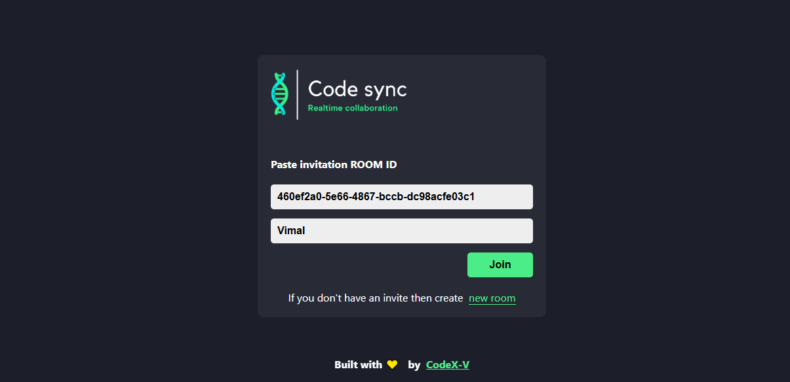
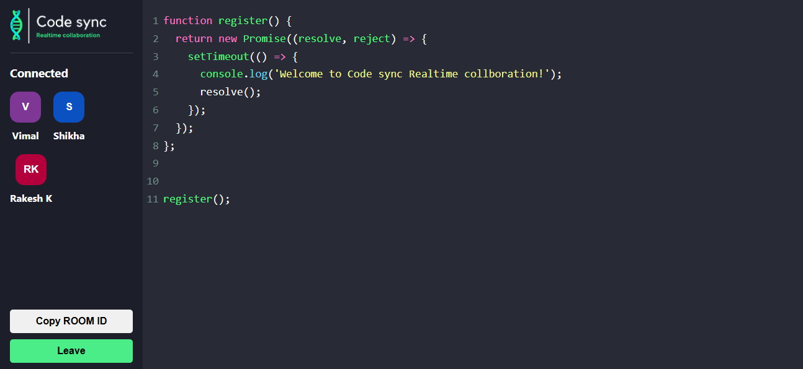

---

<h1 align="center">💻 Realtime Code Editor 🧠</h1>
<p align="center">
  A lightning-fast collaborative code editor built using <b>React.js</b>, <b>Socket.IO</b>, and <b>Express.js</b> that lets multiple users write and share code in real-time!
</p>

<p align="center">
  
  
  
  
</p>

---

## 🚀 Features

✅ Create or join a live coding room  
✅ Real-time code collaboration across browsers  
✅ Beautiful and responsive user interface  
✅ Copy room ID to invite others  
✅ Handles user connect/disconnect events  
✅ Works on local networks for team environments

---

## 🛠️ Technologies Used

| Tech Stack        | Description                         |
|-------------------|-------------------------------------|
| ⚛️ React.js       | Frontend Framework                  |
| 📦 Socket.IO      | Real-time Communication              |
| 🌐 Express.js     | Node.js Web Server                   |
| 🎨 Codemirror     | Code Editor in Browser               |
| ☁️ UUID           | Generate unique room IDs             |
| 🔥 React Toastify | Notifications and user alerts        |
| 👥 React Avatar   | User avatars with initials           |
| 📡 CORS           | Cross-Origin Resource Sharing setup  |

---

## 📸 Screenshots


### 🏁 Join Room Page


### 🧑‍💻 Code Editor with Multiple Users



---

## 📂 Folder Structure

```

realtime-editor/
├── build/                # Production build (after build)
├── public/               # Static assets
├── src/                  # React components and logic
│   ├── components/       # Editor component
│   ├── pages/            # EditorPage, HomePage
│   └── Action.js         # Socket event constants
├── server.js             # Express + Socket.IO backend
├── package.json          # Scripts and dependencies
└── README.md             # You are here!

```

---

## ⚙️ Scripts

| Command              | Action                              |
|----------------------|-------------------------------------|
| `npm run start:front`| Run frontend in development mode    |
| `npm run server:dev` | Run backend with nodemon            |
| `npm run build`      | Create production build             |
| `npm run start`      | Build and start production server   |

---

## 🙏 Special Thanks

This project is deeply inspired and guided by the teachings of **Rakesh K Sir** on [Coder's Gyan YouTube Channel](https://www.youtube.com/c/CodersGyan).  
Thank you sir for making such complex topics so simple and inspiring learners like me to build real-world apps.

---

## 📎 GitHub Repo

🔗 [View on GitHub](https://github.com/Munchunnce/realtime-editor-V)

---

## 📌 Future Improvements

- Code language syntax highlighting  
- File sharing support  
- Voice chat or video integration  
- Authentication & user profiles  
- Multiple file tabs  

---

## 📜 License

This project is licensed under the [MIT License](https://opensource.org/licenses/MIT).

---

> Made with ❤️ by **Vimal Kumar Chaudhary**
```

---

